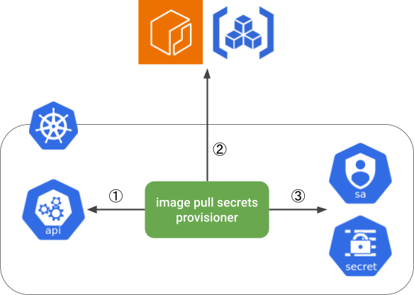

# Image pull secrets provisioner

Image pull secrets provisioner is a Kubernetes controller that provisions image pull secrets for container image registries to any Kubernetes cluster.

The controller creates and refreshes short-lived credentials for container registries through identity federation, and tailor them to be available as image pull secrets.

## How it works



Image pull secrets provisioner watches Kubernetes ServiceAccounts and performs the following operations for each principal.

1. Creates a ServiceAccount's token
    - The token is a signed JWT
2. Exchanges the ServiceAccount token with short-lived access token for a container registry through identity federation
    - The container registry provider verifies the identity and validity of the ServiceAccount token
3. Creates or updates an image pull secret that contains the access token,
   and adds it to the ServiceAccount's `.imagePullSecrets` field
    - Pods using the ServiceAccount will be able to pull container images using the image pull secret

## Supported container image registries

Currently, image pull secrets provisioner supports the following container registries.

- [Amazon ECR](https://aws.amazon.com/ecr/)
- [Google Artifact Registry](https://cloud.google.com/artifact-registry)

## Prerequisites

Image pull secrets provisioner presents Kubernetes ServiceAccount tokens (signed JWT) to container registry providers, and then providers verify ServiceAccount tokens following OIDC protocol.
The following configuration is required to enable container registry providers to verify ServiceAccount tokens.

- Configure your Kubernetes cluster as an OpenID provider
    - See [Configure Service Accounts for Pods | Kubernetes](https://kubernetes.io/docs/tasks/configure-pod-container/configure-service-account/#service-account-issuer-discovery) for details
- Create OIDC provider for your Kubernetes cluster in your container registry provider
    - See each container registry provider documentation for details
        - [Creating OpenID Connect (OIDC) identity providers - AWS Identity and Access Management](https://docs.aws.amazon.com/IAM/latest/UserGuide/id_roles_providers_create_oidc.html)
        - [Configure workload identity federation with Kubernetes | IAM Documentation | Google Cloud](https://cloud.google.com/iam/docs/workload-identity-federation-with-kubernetes#create_the_workload_identity_pool_and_provider)
    - See also [Example Terraform configuration for identity federation](#example-terraform-configuration-for-identity-federation).

## Installation

You can use a Kustomize app in [`config/default`](./config/default/) directory.

You need to allow the image pull secrets provisoner's ServiceAccount (defined in [`config/rbac/service_account.yaml`](./config/rbac/service_account.yaml))
to create tokens for your ServiceAccounts.
You can create a ClusterRole like the following and bind it to the provisioner ServiceAccount.

```yaml
apiVersion: rbac.authorization.k8s.io/v1
kind: ClusterRole
metadata:
  name: tokenrequest
rules:
- apiGroups:
  - ""
  resources:
  - serviceaccounts/token
  verbs:
  - create
```

## How to use

1. Configure identity federation between a Kubernetes ServiceAccount and a container registry provider
    - See each provider documentation for details
        - [Identity providers and federation - AWS Identity and Access Management](https://docs.aws.amazon.com/IAM/latest/UserGuide/id_roles_providers.html)
        - [Configure workload identity federation with Kubernetes | IAM Documentation | Google Cloud](https://cloud.google.com/iam/docs/workload-identity-federation-with-kubernetes)
    - See also [Example Terraform configuration for identity federation](#example-terraform-configuration-for-identity-federation).
2. Annotate the ServiceAccount with the configuration for image pull secret provisioning
    - Amazon ECR:
      ```yaml
      apiVersion: v1
      kind: ServiceAccount
      metadata:
        namespace: NAMESPACE
        name: SERVICE-ACCOUNT-NAME
        annotations:
          # Registry to which a provisioned image pull secret authenticates
          imagepullsecrets.preferred.jp/registry: 999999999999.dkr.ecr.LOCATION.amazonaws.com
          # Audience value expected by the trust policy for the identity federation
          imagepullsecrets.preferred.jp/audience: sts.amazonaws.com
          # ARN of an IAM role that the ServiceAccount will assume
          imagepullsecrets.preferred.jp/aws-role-arn: arn:aws:iam::999999999999:role/ROLE-NAME
      ```
    - Google Artifact Registry:
      ```yaml
      apiVersion: v1
      kind: ServiceAccount
      metadata:
        namespace: NAMESPACE
        name: SERVICE-ACCOUNT-NAME
        annotations:
          # Registry to which a provisioned image pull secret authenticates
          imagepullsecrets.preferred.jp/registry: LOCATION-docker.pkg.dev
          # Audience value expected by the workload identity provider
          imagepullsecrets.preferred.jp/audience: //iam.googleapis.com/projects/999999999999/locations/global/workloadIdentityPools/POOL-NAME/providers/PROVIDER-NAME
          # Full resource name of the workload identity provider
          imagepullsecrets.preferred.jp/googlecloud-workload-identity-provider: projects/999999999999/locations/global/workloadIdentityPools/POOL-NAME/providers/PROVIDER-NAME
          # Email address of the Google service account to which the Kubernetes ServiceAccount will impersonate
          imagepullsecrets.preferred.jp/googlecloud-service-account-email: SERVICE-ACCOUNT-ID@PROJECT-NAME.iam.gserviceaccount.com
      ```
    - Principal annotations (`aws-role-arn` and `googlecloud-service-account-email`) can specify multiple principals separated by commas. Multiple image pull secrets will be provisioned for the ServiceAccount, one for each principal.
3. Use the ServiceAccount for a pod by setting pod's `.spec.serviceAccountName` field
   ```yaml
   apiVersion: v1
   kind: Pod
   metadata:
     name: POD-NAME
   spec:
     serviceAccountName: SERVICE-ACCOUNT-NAME
   ...
   ```
   See also [Configure Service Accounts for Pods | Kubernetes](https://kubernetes.io/docs/tasks/configure-pod-container/configure-service-account/)
4. The pod will be able to pull container images from the registry

## Image pull secret name

By default, image pull secrets provisioner creates an image pull secret with the name `imagepullsecret-SERVICE-ACCOUNT-NAME`.
If you want to use a different name, you can specify it in the ServiceAccount's annotation.

```yaml
apiVersion: v1
kind: ServiceAccount
metadata:
  namespace: NAMESPACE
  name: SERVICE-ACCOUNT-NAME
  annotations:
    imagepullsecrets.preferred.jp/secret-name: SECRET-NAME
```

## Pod eviction

Image pull secrets added to a ServiceAccount's `.imagePullSecrets` field do *not* apply to existing pods using the ServiceAccount.
Pods can be stuck in container image pull failures if they are created before an image pull secret is provisioned for their ServiceAccounts.
To recover from this situation, image pull secrets provisioner evicts pods that are failing to pull images because they do not have an image pull secret provisioned for their ServiceAccount.

This behavior can be disabled by passing `--disable-pod-eviction` command line flag.

## Troubleshooting

### Image pull secret is not provisioned

Image pull secrets provisioner emits Kubernetes events for ServiceAccounts when it succeeds or fails to provision image pull secrets.
Inspect a ServiceAccount's events through `kubectl describe serviceaccount NAME` and try to find out what is wrong.

## Appendix

### Example Terraform configuration for identity federation

<details>
<summary>Amazon ECR</summary>
<p>

```terraform
locals {
  issuer = "ISSUER-DOMAIN"
  sub    = "system:serviceaccount:NAMESPACE:NAME"
}

# Create an OIDC provider for your Kubernetes cluster.
data "tls_certificate" "provider" {
  url = "https://${local.issuer}"
}

resource "aws_iam_openid_connect_provider" "provider" {
  url             = "https://${local.issuer}"
  client_id_list  = ["sts.amazonaws.com"] # Audience value expected by this provider.
  thumbprint_list = [data.tls_certificate.provider.certificates[0].sha1_fingerprint]
}

# Allow your Kubernetes ServiceAccount to assume an AWS IAM role.
# The role has permission to get ECR authorization tokens.
data "aws_iam_policy_document" "assume_role_policy" {
  statement {
    effect = "Allow"
    principals {
      type        = "Federated"
      identifiers = [aws_iam_openid_connect_provider.provider.arn]
    }
    actions = ["sts:AssumeRoleWithWebIdentity"]

    condition {
      test     = "StringEquals"
      variable = "${local.issuer}:aud"
      values   = ["sts.amazonaws.com"]
    }

    condition {
      test     = "StringEquals"
      variable = "${local.issuer}:sub"
      values   = [local.sub]
    }
  }
}

data "aws_iam_policy_document" "ecr_get_authorization_token_policy" {
  statement {
    effect = "Allow"
    actions = [
      "ecr:GetAuthorizationToken",
    ]
    resources = ["*"]
  }
}

resource "aws_iam_role" "federated" {
  name               = "ROLE-NAME"
  assume_role_policy = data.aws_iam_policy_document.assume_role_policy.json
  inline_policy {
    name   = "ECRGetAuthorizationToken"
    policy = data.aws_iam_policy_document.ecr_get_authorization_token_policy.json
  }
}

# Create an ECR repository and allow the role to pull container images from it.
resource "aws_ecr_repository" "repository" {
  name = "REPOSITORY-NAME"
}

data "aws_iam_policy_document" "repository_policy" {
  statement {
    effect = "Allow"
    principals {
      type        = "AWS"
      identifiers = [aws_iam_role.federated.arn]
    }
    actions = [
      "ecr:BatchGetImage",
      "ecr:GetDownloadUrlForLayer",
    ]
  }
}

resource "aws_ecr_repository_policy" "policy" {
  repository = aws_ecr_repository.repository.name
  policy     = data.aws_iam_policy_document.repository_policy.json
}
```

</p>
</details>

<details>
<summary>Google Artifact Registry</summary>
<p>

```terraform
locals {
  issuer = "ISSUER-DOMAIN"
  sub    = "system:serviceaccount:NAMESPACE:NAME"
}

# Create a workload identity pool and provider for your Kubernetes cluster.
resource "google_iam_workload_identity_pool" "pool" {
  workload_identity_pool_id = "POOL-NAME"
}

resource "google_iam_workload_identity_pool_provider" "provider" {
  workload_identity_pool_provider_id = "PROVIDER-NAME"
  workload_identity_pool_id          = google_iam_workload_identity_pool.pool.workload_identity_pool_id
  attribute_mapping = {
    "google.subject" = "\"${local.issuer}::\" + assertion.sub"
  }
  oidc {
    issuer_uri = "https://${local.issuer}"
  }
}

# Allow your Kubernetes ServiceAccount to impersonate a Google service account.
resource "google_service_account" "sa" {
  account_id = "SERVICE-ACCOUNT-ID"
}

resource "google_service_account_iam_member" "federated" {
  service_account_id = google_service_account.sa.id
  role               = "roles/iam.workloadIdentityUser"
  member = join("/", [
    "principal://iam.googleapis.com/projects/PROJECT-ID/locations/global",
    "workloadIdentityPools/${google_iam_workload_identity_pool.pool.workload_identity_pool_id}",
    "subject/${local.issuer}::${local.sub}",
  ])
}

# Create a Artifact Registry repository and allow the Google service account to pull container images from it.
resource "google_artifact_registry_repository" "repository" {
  location      = "LOCATION"
  repository_id = "REPOSITORY-NAME"
  format        = "DOCKER"
}

resource "google_artifact_registry_repository_iam_member" "repository_iam_member" {
  location   = google_artifact_registry_repository.repository.location
  repository = google_artifact_registry_repository.repository.name
  role       = "roles/artifactregistry.reader"
  member     = google_service_account.sa.member
}
```

</p>
</details>
